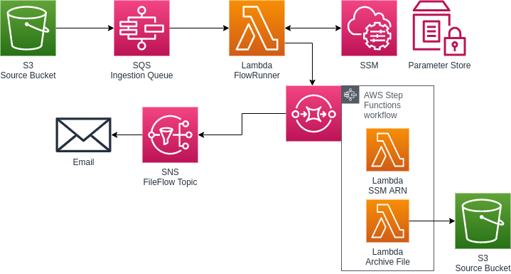
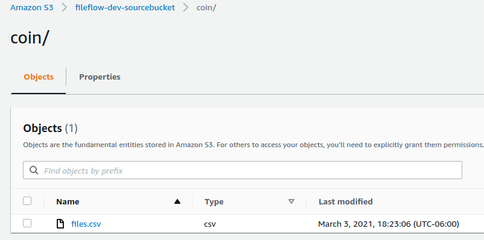
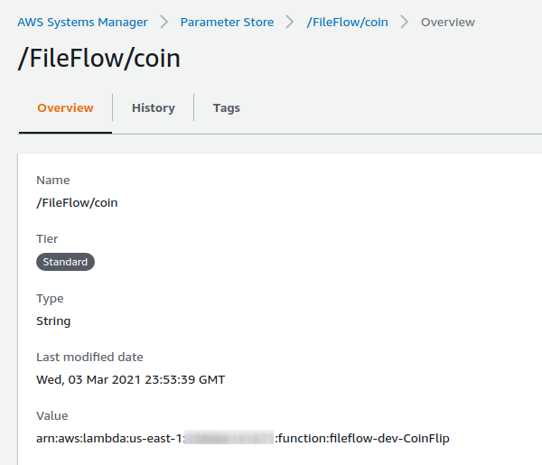
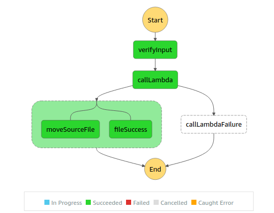
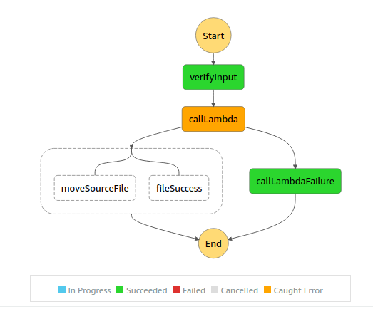
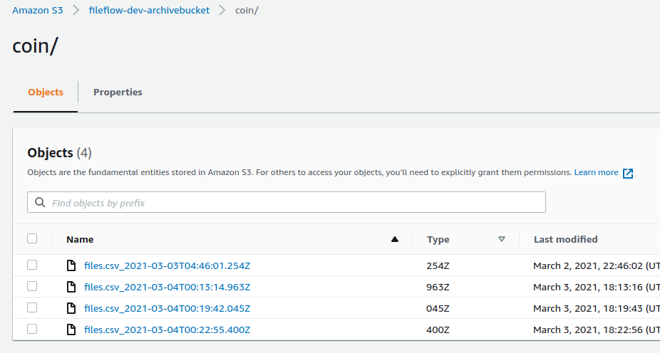

FileFlow is a modular system that will invoke Lambdas when a new file appears in an S3 bucket.

It invokes the Lambda that is configured for the file prefix (directory) for processing and notifies SNS subscriptions who filter for that prefix.

1. A file is created in the source S3 bucket with a prefix.

1. A parameter for the file prefix holds the Lambda ARN that should process the file.

1. The Lambda is invoked from a StepFunctions Workflow. If the Lambda errors, the results are sent to an SNS Topic and the file is held in the source bucket. If the Lamda succeeds, the file is sent to the arhive bucket with a timestamp suffix, and the success is sent to an SNS Topic.

1. SNS Subscriptions can filter on specific file prefixes to only be notified on specific files.

